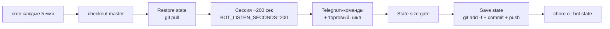
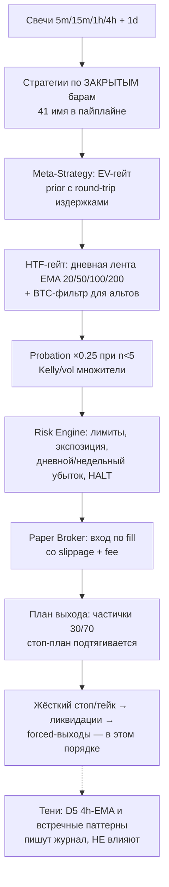
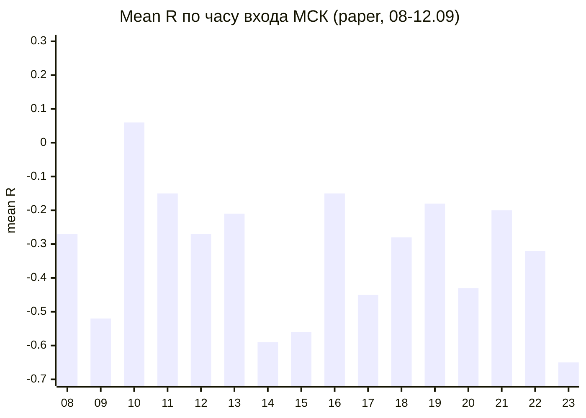
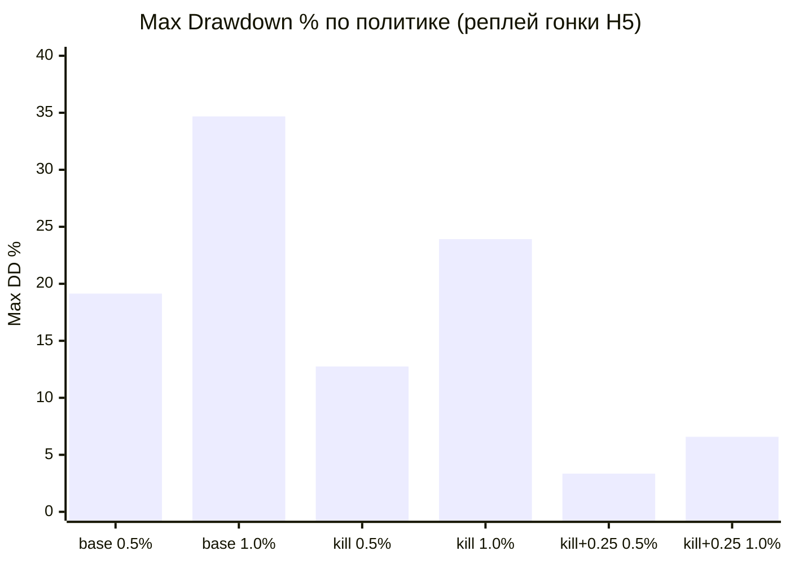
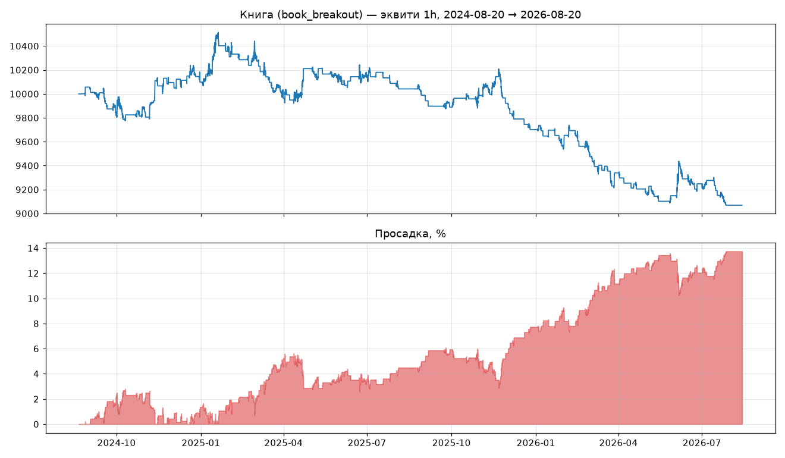
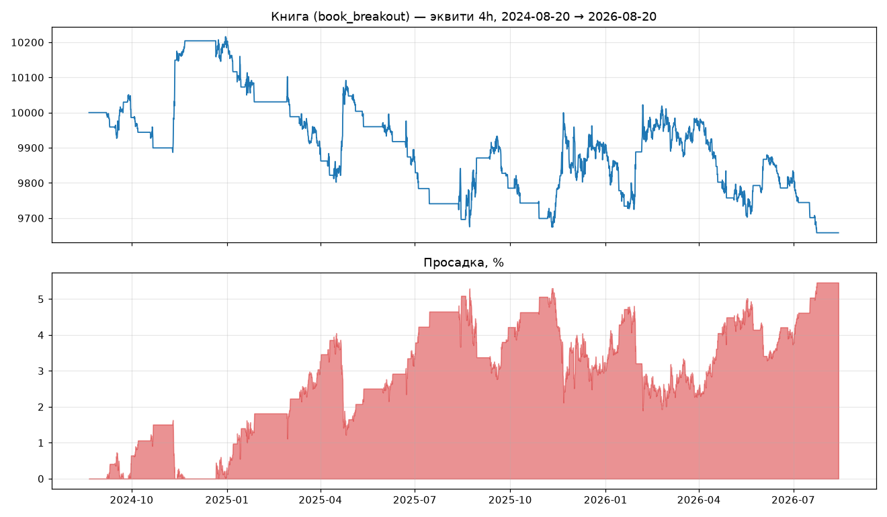

# ASTRA BOT


**Торговый бот для бессрочных фьючерсов BingX (USDT-M) в режиме paper-trading.**
Работает 24/7 на бесплатных GitHub Actions: каждые 5 минут поднимается короткая сессия (~200 сек), которая принимает решения, торгует и сохраняет состояние обратно в репозиторий.

> ⚠️ **Реальные деньги отключены.** Проект существует в двух ипостасях: публичная бумажная машина (этот репозиторий) и личные эксперименты владельца. Никакие действия здесь не являются финансовой рекомендацией.

---

## 🎯 Главный принцип

**Сначала край (edge ≥ 0) → потом использование → потом масштаб.**

Живая статистика бота (см. [Измеренные результаты](#-измеренные-результаты-paper)) показывает отрицательное матожидание на сделку. Поэтому:

- лимиты риска сейчас **защищают** капитал — поднимать их запрещено до подтверждённого PF > 1;
- ни один параметр не меняется «на глаз» — любое число должно иметь источник (конфиг, тест, биржевая спека, решение владельца);
- после каждого цикла изменений действует **двухнедельное окно фиксации правил** — валидационный период без подгонок.

---

## 🔄 Как живёт бот (жизненный цикл сессии)



- **Расписание**: `*/5 * * * *` — круглосуточно (решение владельца 13.09: крипта не спит). Месячный бюджет часов — 750 (`trading_schedule.py`), переопределяется `TRADE_HOURS_PER_MONTH` и `TRADE_ACTIVE_HOURS_MSK`.
- **Состояние** переживает перезапуск: атомарная запись (tmp + `os.replace`), восстановление бандла при старте, двойной учётный реестр с replay-дедупликацией.
- **Параллельность сессий** запрещена (`concurrency: astra-bot`).

---

## 🌐 Торгуемый юниверс: 35 пар (`TRADING_UNIVERSE`)

Прод-контур в CI (`scripts/run_bot.py`) перебирает кандидатов из `TRADING_UNIVERSE` (`astra_bot/core/instruments.py`) — 35 ликвидных USDT-пар BingX USDT-M. Перед торговлей список фильтруется по фактическому статусу `trading` на бирже; при недоступности фильтра используется весь статический юниверс.

> ⚠️ `SystemConfig.instruments` (10 пар, `astra_bot/core/config.py`) — мёртвый legacy-конфиг: прод-контур его не читает, golden-тест фиксирует его только как отдельный канон конфига. Актуальный канон живого юниверса — приведённый ниже список.

BTC · ETH · SOL · BNB · XRP · ADA · AVAX · DOGE · LINK · DOT · TRX · LTC · BCH · ATOM · NEAR · APT · ARB · OP · SUI · INJ · TIA · FIL · ICP · HBAR · AAVE · UNI · FET · TON · XLM · SHIB · PEPE · ETC · CRO · MKR · XMR (все против USDT)

---

## 🧭 Пайплайн решения (по каждому символу, каждый цикл)



Подробно: [docs/DECISION_PIPELINE.md](docs/DECISION_PIPELINE.md), [docs/EXIT_PLAN_MAP.md](docs/EXIT_PLAN_MAP.md), [docs/META_STRATEGY.md](docs/META_STRATEGY.md).

---

## 🗡️ Стратегии: честный kill-switch

В пайплайне 41 стратегия-имя (18 паттерн-фигур — ядро по директиве владельца, 3 HTF-свинг-стратегии на дневках, остальные — импульс/откат/стат-механики). Каждые ~5 минут статистика решает, кто торгует:

- правило: **n ≥ 5 (реальных сделок) и PF < 1 → стратегия удаляется** до выправления статистики;
- учитываются **только position-unique ANY-бакеты** — одна сделка считается один раз (до фикса #76 режимные копии завышали n в 2–3 раза);
- стратегии с n < 5 торгуют с **probation-риском ×0.25**; продвижение — при n ≥ 5, «красивый PF на 2–4 сделках» не считается.

**Семь подтверждённо мёртвых** (paper, 08–12.09, пересчёт по position id):

| стратегия | n | PF |
|---|---:|---:|
| momentum | 38 | 0.21 |
| double_top_bottom | 7 | 0.53 |
| cup_and_handle | 6 | 0.55 |
| scalp | 6 | 0.009 |
| trend_following | 6 | 0.33 |
| flag | 5 | 0.61 |
| pullback | 5 | 0.00 |

Остальные 24 ложно казнённые имени **вернулись в пайплайн** (#76) — на четвертьриске, пока не наберут n ≥ 5.

---

## 🎛️ Управление сделкой

| Этап | Что происходит |
|---|---|
| Вход | EV-гейт с **round-trip издержками** `2×(fee+slippage)/stop` — на 5m стопе ~1% это ~0.3R гандикапа, слабые кандидаты отсекаются |
| Тейк | Двухуровневый план: **1R × 30%** + хвост через `clamp_take_rr` (**2.0–2.3R** × 70%) |
| После первой частички | Стоп → **безубыток** (сырой вход, только подтягивание; риск не возвращается) |
| Стоп-план | D1: структурное подтягивание по закрытым барам; инвариант — стоп **только** сжимается, никогда не расширяется и не снимается |
| Forced-выходы | `MAX_HOLD` 48ч, `VOL_EXPANSION`, `BTC_PANIC`, `mae_cut`, ликвидации — иерархия фиксирована тестами |
| Антидребезг | После выхода по стопу: cooldown **20 минут** на пару «стратегия\|символ\|сторона», реестр в state |

---

## 🛡️ Лимиты риска

| Лимит | Значение | Где |
|---|---|---|
| Риск на сделку | **1% NET-капитала** | `TradingEngineConfig.risk_per_trade_pct` |
| Потолок риска | 3% (`max_risk_pct`) | `position_sizer.py` |
| Нотионал позиции | ≤ 10% капитала | `position_sizer.py` |
| Открытых позиций | 3 (одна сторона — 2) | `max_open_positions` |
| Суммарная экспозиция | ≤ 30% | `max_total_exposure_pct` |
| Плечо | Лестница по уверенности, в CI потолок **3×** (`ASTRA_LEVERAGE_MAX`); инвариант «стоп умирает раньше ликвидации»: плечо срезается до `1/(дист_стопа + mm) − 1` | `trading_engine.py` |
| Дневной/недельный убыток | Входы блокируются сверх лимитов | `risk_engine.py` |
| Системный HALT | 5 убыточных дней подряд / −3% за неделю → торговля стоп | `core/kill_switch.py` |

При **недельном лимите** новые входы с размером **не** открываются; пайплайн по задумке может продолжать считать сигналы и писать тень/`no_trade` (observe-only). Исполненный PnL и «учёба на сделках» — только после сброса лимита.

---

## 💸 Издержки (пресет BingX perps)

| Параметр | Значение |
|---|---|
| Taker fee | 0.05% |
| Maker fee | 0.02% |
| Slippage (модель) | 0.1% |
| Круг (вход+выход) | ~0.3% номинала |

При стопе 1% (5m-стратегии) круг съедает **~0.3R** каждой сделки — главный структурный минус внутридневного таймфрейма; на 4h (стопы 2–3%) гандикап втрое меньше. EV-приор кандидатов считает издержки честно (обе стороны) с #76.

---

## 📊 Измеренные результаты (paper)

> ⚠️ Все числа — **бумажные, выборка мала** (5 дней активной торговли). Это не доказательство эджа — это мониторинг здоровья машины.

### По эпохам

| Период | Сделок | Mean R | Комментарий |
|---|---:|---:|---|
| 08–11.09 (до #70) | 123 | **−0.32** | лестница тейков, гэп-стопы, mae_cut −1.5R |
| 11–12.09 (после #70) | 9 | **−0.21** | стоп-выходы все лучше −0.8R, ноль гэпов, лучший день −61 при старых −356/−989/−415 |
| после 13.09 (#74–#77) | наблюдение | — | двухнедельное окно валидации → срез **26–27.09** |

### Mean R по часу входа (МСК), 08–12.09



Ночные часы (00–07) в этой выборке пусты — 24/7 включён только с 13.09; ночной бакет наполняется и будет оценён на срезе.

### Эксперимент масштабирования (гонка политик H5, реплей 130 сделок)

Удвоение риск-бюджета при отрицательной серии **удваивает просадку, не прибыль**:



**Вердикт: кран капитала закрыт до PF > 1 на реальном счёте.** Честный kill-switch сохранил бы +14.9R, probation ×0.25 режет остаточный убыток выборки в 4 раза (−27.2R → −6.8R взвешенных).

### Внешние стратегии (Track C / «Зевс», deep history 2021–2026)

Прогон Actions (BTC/ETH/SOL, **1h+4h**, bootstrap 20k). Короткое окно (#77: Z3 +0.39R @ n=8, Z4 +0.50R @ n=10) **не подтвердилось**.

**Pooled OOS:**

| Variant | n | mean R | Вердикт |
|---|---:|---:|---|
| Z1_retest (контроль) | 2100 | **−0.55** | none — ожидаемый провал |
| Z2_divergence | 283 | −0.11 | none |
| Z3_false_breakout | 343 | **−0.12** | none |
| Z4_overshoot | 265 | **−0.17** | none |
| Z5_channel_touch | 28 | −0.31 | none |
| Z6_htf_gated_retest | 596 | **−0.47** | none (HTF coverage ≈ 0.36–0.41) |
| Z7_zone_reaction | 252 | **−0.40** | none |
| baseline_breakout | 723 | −0.04 | ≈0 |

Точечные плюсы (n≤6) — анекдот. В боевой код из Z-семьи **ничего** не переносится. Артефакт: Actions `track-c-deep-history`.

> Дискреционный стиль уроков (фигуры/индикаторы «глазами» на разных масштабах) ≠ эти авто-детекторы и здесь не опровергается — в бот он не кодировался.

### Research snapshot (до среза 26–27.09)

| Гипотеза | Статус | Где цифры |
|---|---|---|
| 4h breakout-семья | шум с намёком; под 0.3% RT PF≈1.07–1.13 | `docs/research/WALKFORWARD_4H_BREAKOUT.md` |
| tsm45 | **опровергнута** панелью (OOS PF≈0.85); узкая тень запрещена | `docs/research/TSM45_PANEL_32.md` |
| Старые семейства на 4h | мертвы под нашими издержками | `docs/research/AB_PROXY_SWEEP_4H_OOS.md` |
| entry_gates | shadow on / live off; include iff n≥30 и median(hypothetic_r)<0 | `docs/research/ENTRY_GATES_TELEMETRY_CHECK.md` |
| Памятка среза | один документ = одна правда | [DECISION_MEMO_2026-09-26.md](docs/research/DECISION_MEMO_2026-09-26.md) |

Онбординг 4h-ключей — только shadow → ×0.25 → promote при n≥5 и live PF≥1. Research-PR **не** трогает живой контур.

### Книжные / research equity (честные минусы)

Пробой→ретест «по книге» на BTC/USDT ~2 года — **не** edge (`docs/book_backtest_2y/summary.md`):

| TF | Сделок | PF | PnL |
|---|---:|---:|---:|
| 1h | 160 | 0.80 | −9.3% |
| 4h | 47 | 0.79 | −3.4% |

<p align="center">
  
</p>

<p align="center"><em>1h equity: пробой+ретест, риск 0.4%, издержки 0.2% RT — ниже нуля.</em></p>

<p align="center">
  
</p>

<p align="center"><em>4h equity: меньше сделок, тот же знак — PF&lt;1.</em></p>

---

## 🔬 Тени (фаза-0: пишут, не решают)

| Система | Что делает | Файл |
|---|---|---|
| D5 HTF-shadow | Записывает гипотетические запреты кандидатов против 4h-EMA20/50 тренда | `models/htf_shadow_bans.jsonl` |
| Pattern-exit shadow | Фиксирует встречные разворотные паттерны по **открытым** позициям | `models/pattern_exit_shadow.jsonl` |
| entry_gates shadow | «Не торгуй в шуме» + hypothetic_r в NO_TRADE; live off до среза | `models/no_trade_observations.jsonl` |

Append-only, best-effort, ошибками не роняют торговлю. Включение в бой — отдельным решением по накопленным данным.

---

## 📚 Честность данных (что делает результаты проверяемыми)

- **Снапшот входа** в каждой строке сделки: `signal_bar_close, effective_entry, initial_stop/take, stop_pct, confidence, ml_probability, prior_r, costs_r, equity_before, risk_budget, binding_constraint` — 12 полей, аддитивно к старым строкам.
- **Журнал отклонённых сигналов** (`rejection_stage=capacity/exposure/direction/entry_gate`) — можно ретроспективно ответить «а что если бы лимиты были шире».
- **Двойная запись**: `models/paper_ledger.jsonl` — каждая позиция = order/fill/fee-события, частичные выходы пишут свои события, replay сходится с брокером до копейки (fee живёт только в `kind="fee"`).
- **Атомарный state** (tmp + `os.replace`), гейт размера `check_state_size.py`, ротация jsonl-журналов.

---

## 📲 Telegram

Команды бота: статус, баланс, позиции, история, принудительная проверка цикла. Алерты: HALT (дедуп раз в UTC-сутки), критические события. Токен и chat-id — в секретах репозитория.

---

## ⚙️ Эксплуатация

- **CI**: `.github/workflows/bot.yml` — единственный workflow живого бота, правится **владельцем вручную** через веб (полным файлом). Research-workflows (Track C, lab) — отдельные YAML, согласуются до коммита.
- **Секреты**: `BINGX_API_KEY/SECRET`, `TELEGRAM_BOT_TOKEN/ADMIN_ID` — в Actions secrets, попадают в `.env` только внутри сессии.
- **State-файлы** (коммитятся ботом в `chore(ci): bot state` каждые ~5 мин): позиции, сделки, ledger, статистика стратегий, тени, observations, budget. Рост ограничен гейтом и ротацией.

---

## 🚧 Известные ограничения (честно)

- **Paper-only**: издержки модельные; реальное проскальзывание неизвестно (телеметрия исполнения пишется с #76 — будет накоплена).
- **Выборки малы**: 130 позиций за 5 дней — мониторинг, не доказательство.
- **Бэктестер** семантически оптимистичнее paper (текущий бар считается закрытым — B10, один тейк, нет funding): сравнивать можно только прогоны между собой. См. [docs/BACKTEST_VS_PAPER_SEMANTICS.md](docs/BACKTEST_VS_PAPER_SEMANTICS.md).
- **Rate-limit**: основной клиент 5 qps + 4 прямых клиента стратегий со своими бакетами (до 20 qps burst) — консолидация в бэклоге.
- **Track C deep history** — Actions + Binance Vision/`fetch_klines`, BTC обязателен; pooled OOS выше. Короткое окно #77 — только исторический анекдот.

---

## 📖 История изменений (мержи)

| PR | Дата | Что вошло |
|---|---|---|
| #68 | 08.09 | kill-switch, STRUCT-TP, утренний репорт, oi_history |
| #69 | 10.09 | A1–A7: NET-капитал, str-позиции, лимиты, инвариант ликвидации |
| #70 | 11.09 | Единый исполнитель выходов (D1), потолок риска 3%, один тейк 2–2.3R |
| #71 | 12.09 | HTTP-аутентификация, RiskConfig, версии фичей, двойной ledger, E2E-replay |
| #72 | 12.09 | D5-тень, круглая вершина/дно, антидребезг, ob_swing/breaker_block/maicross, HTF-гейты |
| #74 | 12.09 | Ledger: частичные события; сайзинг по effective entry; README = код; поглощён PR #73 |
| #75 | 13.09 | Частички 30/70 + безубыток; 24/7 в коде; тень паттерн-выходов; скрипт среза |
| #76 | 13.09 | Честный kill-switch (ANY), probation ×0.25, round-trip costs, снапшоты входа, capacity-журнал |
| #77 | 14.09 | Track C: первый суд (короткое окно; Z1−, Z3/Z4 анекдот) |
| #87–#89 | 15–16.09 | Research: 4h walk-forward, onboarding specs, tsm45 panel (закрыт), decision memo |
| #90–#92 | 16.09 | Track C на Actions: workflow, timeout/matrix, fix `TIMEFRAMES=("4h",)` |

Полный индекс документации — [docs/INDEX.md](docs/INDEX.md). Срез каждые 2 недели: `python scripts/measure_two_week_review.py`. Памятка владельца: [docs/research/DECISION_MEMO_2026-09-26.md](docs/research/DECISION_MEMO_2026-09-26.md).

---

## 🧪 Разработка

```bash
python3 -m venv /tmp/venv
/tmp/venv/bin/pip install -r requirements.txt pytest pytest-asyncio
/tmp/venv/bin/python -m pytest tests/ -q -p no:warnings   # 1095 collected, exit 0
git checkout -- data/ logs/ models/                        # откат тестового загрязнения
ruff check <изменённые файлы>
```

Каноны: один PR = одна тема; тесты не «зеленятся» подгонкой; каждый факт в отчёте = `файл:строка` + цитата; большие файлы правятся только скриптом точечной замены.

---

## ⚠️ Дисклеймер

Этот проект — учебно-исследовательский. Торговля фьючерсами с плечом ведёт к полной потере средств. Всё в репозитории — бумажный контур; автор и контрибьюторы не несут ответственности за использование кода с реальными деньгами.

## Лицензия

MIT.
