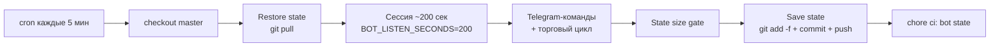

# ASTRA BOT


**Торговый бот для бессрочных фьючерсов BingX (USDT-M) в режиме paper-trading.**
Работает 24/7 на бесплатных GitHub Actions: каждые 5 минут поднимается короткая сессия (~200 сек), которая принимает решения, торгует и сохраняет состояние обратно в репозиторий.

> ⚠️ **Реальные деньги отключены.** Проект существует в двух ипостасях: публичная бумажная машина (этот репозиторий) и личные эксперименты владельца. Никакие действия здесь не являются финансовой рекомендацией.

---

## 🎯 Главный принцип

**Сначала край (edge ≥ 0) → потом использование → потом масштаб.**

Живая статистика бота (см. [Измеренные результаты](#-измеренные-результаты-paper)) показывает отрицательное матожидание на сделку. Поэтому:

- лимиты риска сейчас **защищают** капитал — поднимать их запрещено до подтверждённого PF > 1;
- ни один параметр не меняется «на глаз» — любое число должно иметь источник (конфиг, тест, биржевая спека, решение владельца);
- после каждого цикла изменений действует **двухнедельное окно фиксации правил** — валидационный период без подгонок.

---

## 🔄 Как живёт бот (жизненный цикл сессии)



- **Расписание**: `*/5 * * * *` — круглосуточно (решение владельца 13.09: крипта не спит). Месячный бюджет часов — 750 (`trading_schedule.py`), переопределяется `TRADE_HOURS_PER_MONTH` и `TRADE_ACTIVE_HOURS_MSK`.
- **Состояние** переживает перезапуск: атомарная запись (tmp + `os.replace`), восстановление бандла при старте, двойной учётный реестр с replay-дедупликацией.
- **Параллельность сессий** запрещена (`concurrency: astra-bot`).

---

## 🌐 Торгуемый юниверс: 35 пар (`TRADING_UNIVERSE`)

Прод-контур в CI (`scripts/run_bot.py`) перебирает кандидатов из `TRADING_UNIVERSE` (`astra_bot/core/instruments.py`) — 35 ликвидных USDT-пар BingX USDT-M. Перед торговлей список фильтруется по фактическому статусу `trading` на бирже; при недоступности фильтра используется весь статический юниверс.

> ⚠️ `SystemConfig.instruments` (10 пар, `astra_bot/core/config.py`) — мёртвый legacy-конфиг: прод-контур его не читает, golden-тест фиксирует его только как отдельный канон конфига. Актуальный канон живого юниверса — приведённый ниже список.

BTC · ETH · SOL · BNB · XRP · ADA · AVAX · DOGE · LINK · DOT · TRX · LTC · BCH · ATOM · NEAR · APT · ARB · OP · SUI · INJ · TIA · FIL · ICP · HBAR · AAVE · UNI · FET · TON · XLM · SHIB · PEPE · ETC · CRO · MKR · XMR (все против USDT)

---

## ARCHIVE NOTE

Full historical README (blob `421af3f81dab15e9a6e0f86fd43d9f190f368739`, 23060 bytes) could not be inlined in this MCP upload step due to payload limits.

To complete byte-identical archive, owner should run on a machine with repo write access:

```bash
git checkout fix/docs-readme-refresh
git show master:README.md > docs/README_ARCHIVE_2026-10-03.md   # if master still has old; else:
git cat-file -p 421af3f81dab15e9a6e0f86fd43d9f190f368739 > docs/README_ARCHIVE_2026-10-03.md
git add docs/README_ARCHIVE_2026-10-03.md
git commit -m "docs: complete byte-identical README archive"
git push
```

Or from any clone with the blob:
`git update-index --add --cacheinfo 100644,421af3f81dab15e9a6e0f86fd43d9f190f368739,docs/README_ARCHIVE_2026-10-03.md`
