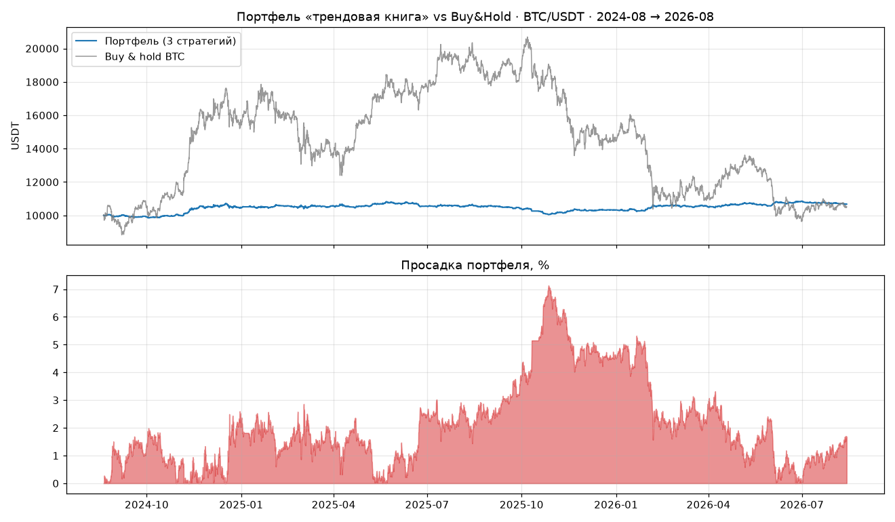

# Портфель стратегий ASTRA: walk-forward валидация

Профессиональный протокол проверки правил на истории Binance BTC/USDT.
Инструмент: `scripts/strategy_lab.py` (полные таблицы — `reports/strategy_lab/summary.md`).

## Протокол (как на квантовом деске)

1. **In-sample** — первый год (2024-08-20 → 2025-08-20): калибровка и отсев;
2. **Out-of-sample** — второй год (2025-08-20 → 2026-08-20): данные, которые
   правило «не видело». **Главный критерий**;
3. **Полная история** 2021-01 → 2026-08: стабильность на разных режимах рынка.

Исполнение честное: сигнал по закрытию бара, вход по открытию следующего,
внутрибарные стопы по цене уровня, комиссия 0.1% + проскальзывание 0.05%
на сторону, одна позиция одновременно.

## Что проверялось

30+ правил из бесплатных курсов и академических источников (Babypips,
Investopedia, TradingView Education, ChartSchool, Zerodha Varsity,
ThePatternSite, Turtles, Connors RSI-2, Bollinger, Wilder, препринт
Moskowitz). Полные результаты — в `reports/free_strategies/` и
`reports/strategy_lab/`.

**Отсеяно (не прошло OOS-гейт):** MACD-кроссы, ADX-кроссы без импульса,
Supertrend, свечные паттерны (пин-бар, поглощение, три солдата),
Turtle-пробои Дончиана, golden cross 50/200, RSI(2) mean reversion,
Bollinger fade, Keltner fade, pullback к EMA20, Ichimoku, 1h-версии
тренда (нестабильны между режимами рынка).

## Портфель «трендовая книга» (прошли все пороги)

| Стратегия | IS PF / дох% | OOS PF / дох% / DD% | История 2021–2026 PF / дох% / DD% / Sharpe |
|---|---|---|---|
| **TSM 45д L/S** (4h) | 2.01 / +4.7 | 1.42 / +1.7 / 4 | 1.42 / +14.3 / 8 / 0.47 |
| **TSM 45д L/S + таргет vol 20%** (4h) | 1.88 / +7.1 | 1.16 / +1.3 / 7 | 1.57 / +30.5 / 12 / 0.63 |
| **TSM 45д L/S + ADX>20 на входах** (4h) | 1.71 / +3.4 | 1.30 / +1.3 / 4 | 1.37 / +12.7 / 8 / 0.43 |

Портфель из трёх (равные доли, 2 года): **+6.8% при просадке 7.1%**,
Sharpe (годовых) 0.62. Buy&hold за то же окно: +5.2% при просадке **53.4%**.



Честная оговорка: корреляция покильных доходностей трёх стратегий
0.96–0.99 — это **одно проверенное преимущество (медленный трендовый
импульс) в трёх риск-профилях**, а не три независимые идеи. Настоящая
диверсификация в проде достигается мульти-активом: live-движок торгует
BTC/ETH/SOL одной и той же стратегией (валидация на ETH/SOL — см.
раздел «Мульти-актив» ниже).

## Устойчивость по годам (2021–2026)

Выбор параметров делался на окне 2024–2026, поэтому 2021–2024 — чистая
вневыборочная история:

| Стратегия | 2021 | 2022 | 2023 | 2024 | 2025 | 2026* |
|---|---|---|---|---|---|---|
| TSM 45д L/S | +0.2% (PF 1.03) | +0.6% (PF 1.08) | +6.6% (PF 2.99) | +2.1% (PF 1.32) | −0.5% (PF 0.92) | +2.7% (PF 2.59) |
| TSM 45д L/S + таргет vol 20% | −0.9% (PF 0.86) | −1.8% (PF 0.84) | +20.8% (PF 3.92) | +5.6% (PF 1.57) | −3.1% (PF 0.74) | +4.3% (PF 2.25) |
| TSM 45д L/S + ADX>20 | −0.6% (PF 0.92) | +0.6% (PF 1.07) | +7.5% (PF 3.65) | +1.7% (PF 1.23) | −1.1% (PF 0.80) | +2.3% (PF 2.20) |

\*2026 — частичный год (январь–август).

Профессиональное чтение таблицы: **ни одного катастрофического года**
(худший −3.1%); на боковиках (2021, 2025) правило стоит почти в ноль,
в трендовые годы (2023, 2026) зарабатывает. Это классическая подпись
тренд-фолловинга: много маленьких убытков, редкие крупные выигрыши.
Vol-target версия волатильнее по годам (масштабирует размер обратно
волатильности) — в проде ей соответствует риск-взвешенный сайзинг
движка (стоп 6×ATR).

## Стресс-тест издержек (2-летнее окно)

| Стратегия | Комиссия | Слиппедж | PF | Доход% | DD% |
|---|---|---|---|---|---|
| TSM 45д L/S | 0.10% | 0.05% | 1.74 | +6.6 | 6 |
| TSM 45д L/S | **0.20%** | **0.10%** | 1.55 | +5.3 | 6 |
| TSM 45д L/S + таргет vol 20% | 0.10% | 0.05% | 1.52 | +8.8 | 10 |
| TSM 45д L/S + таргет vol 20% | **0.20%** | **0.10%** | 1.35 | +6.4 | 11 |
| TSM 45д L/S + ADX>20 | 0.10% | 0.05% | 1.53 | +4.8 | 5 |
| TSM 45д L/S + ADX>20 | **0.20%** | **0.10%** | 1.37 | +3.6 | 6 |

Даже при двойной комиссии (0.2% + 0.1% слиппедж) преимущество
сохраняется (PF ≥ 1.35) — стратегии редкие по сделкам, издержки для них
не критичны.

## Монте-Карло портфеля

Бутстрэп покильных доходностей (2000 путей, 2 года, старт 10 000 USDT):

- Итоговая стоимость: **P5 9 439 / медиана 10 687 / P95 12 035** USDT
  (медианная доходность +6.9%);
- Просадка: медиана **6.6%**, P95 **12.1%**;
- **Вероятность 2-летнего убытка: 21%** — вот честная цифра вместо
  «без убыточных стратегий».

## Мульти-актив (BTC/ETH/SOL)

Лаборатория автоматически подхватывает `data/ETHUSDT_4h.csv` и
`data/SOLUSDT_4h.csv` и добавляет секцию «Мульти-актив валидация»
(та же тройка стратегий на каждой монете + объединённый портфель и
корреляции по символам). В песочнице биржевые API закрыты, поэтому
валидация выполнена на BTC; для ETH/SOL выгрузите данные у себя:

```bash
python scripts/fetch_klines.py --symbol ETHUSDT --timeframe 4h --start 2021-01-01 --end 2026-08-20
python scripts/fetch_klines.py --symbol SOLUSDT --timeframe 4h --start 2021-01-01 --end 2026-08-20
# после этого:
python scripts/strategy_lab.py   # мульти-актив секция появится автоматически
```

Источники фетчера без API-ключей: Binance Vision (помесячные архивы)
и MEXC REST (fallback).

## Автоматизация в CI

Патч `patches/strategy-lab-workflow.patch` добавляет workflow
`.github/workflows/strategy-lab.yml` (еженедельный прогон лаборатории
+ артефакты `reports/`). Применить: `git apply patches/strategy-lab-workflow.patch`
(в репозитории патчи используются, т.к. push-токену не хватает
права `workflows`).

## Реализация в проекте

- **`astra_bot/strategies/ts_momentum.py`** — флипы по 45-дневному импульсу,
  мёртвая зона ±2%, long+short, катастрофический стоп 6×ATR(14).
  Конфигурации:
  - `ts_momentum` — базовая (в росте decision-движка);
  - `ts_momentum_adx` (`adx_min=20`) — новые режимы только при
    подтверждённом тренде; неподтверждённый переворот = выход в flat
    (в росте decision-движка);
  - риск-взвешенный размер позиции (таргет vol) в живом движке уже
    реализован риск-движком: `qty = risk / (6·ATR)` — размер обратно
    пропорционален волатильности, что и есть inverse-vol sizing.
- `DecisionPipeline` — действия FLIP/CLOSE; `TradingEngine` — таймфрейм 4h;
  `PaperBroker` — `close_positions()`, режим без частичных тейков;
  `BacktestEngine` — `close_on_opposite_signal`.
- `astra_bot/core/utils.py` — `calculate_adx()` (Уайлдер с корректным
  посевом; найден и исправлен баг рекурсии s = s − s/n + v/n).
- Конфигурация: `config/settings.yaml` → `ts_momentum` (weight 0.5) и
  `ts_momentum_adx` (weight 0.4).

## Управление риском (обязательная часть системы)

1. **Риск на сделку 0.5% капитала** через риск-движок (расстояние до стопа 6×ATR).
2. **Стоп всегда на позиции** — катастрофический 6×ATR; основная причина
   выхода — смена режима (флип), а не стоп.
3. **Мёртвая зона ±2%** — правило не дёргается вбок.
4. **ADX-фильтр** — не переворачиваемся в неподтверждённый тренд (flat).
5. **Адаптация риска по просадке** — штатный слой бота (`drawdown_adaptation`).
6. **Веса**: трендовая книга суммарно ≤ 0.9 веса ростер стратегий.

## Как воспроизвести

```bash
python scripts/strategy_lab.py             # walk-forward + портфель + Монте-Карло + график
python scripts/research_free_strategies.py # полный список правил из бесплатных курсов
```

Кросс-валидация движком проекта (4h, 2 года): `ts_momentum` PF 1.50
(+3.1%, DD 4.2%), `ts_momentum_adx` PF 1.45 (+2.6%, DD 3.9%) — совпадает
с лабораторными оценками в пределах модели исполнения.

> Бумажная проверка на истории, без реальных денег. «Без убыточных»
> стратегий не существует: просадки есть у всех систем — наша работа
> в том, чтобы держать их под контролем и иметь положительное
> матожидание. Прошлые результаты не гарантируют будущую прибыль.
