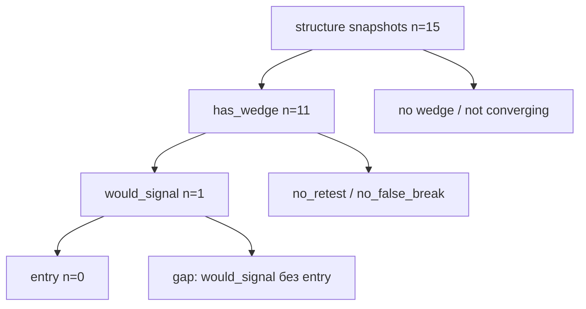
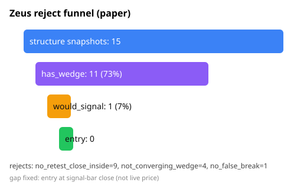

# Воронка отказов Зевса (paper-clock)

Источник: `models/zeus_trade_journal.jsonl`.

## Воронка (structure snapshots)

```
tики structure_state           15  ████████████████████ 100%
  ├─ has_wedge                 11  ██████████████ 73%
  │    ├─ would_signal          1  █ 7%
  │    │    └─ entry            0  · 0%
  └─ reject (journal)          14
```





## Reject reasons

| reason | n | stage |
|--------|---|-------|
| `no_retest_close_inside` | 9 | retest |
| `not_converging_wedge` | 4 | structure |
| `no_false_break` | 1 | breakout |

## Gap would_signal → entry (исправление)

**Причина:** `diagnose` (observe) смотрит структуру по закрытым 4h.  
`evaluate` брал **живую** `current_price` для расчёта risk. После false-break цена часто уже за экстремумом → `risk <= 0` → `None` → в no_trade: `no_strategy_signal`.

**Фикс:** вход paper по **close сигнального закрытого бара**, не по mid-bar live.  
Плюс событие `signal_gap` в journal, если would_signal и позиций 0.

## Не ослабляем

- `no_retest_close_inside` — ядро урока 8
- `not_converging_wedge` — не-клин
